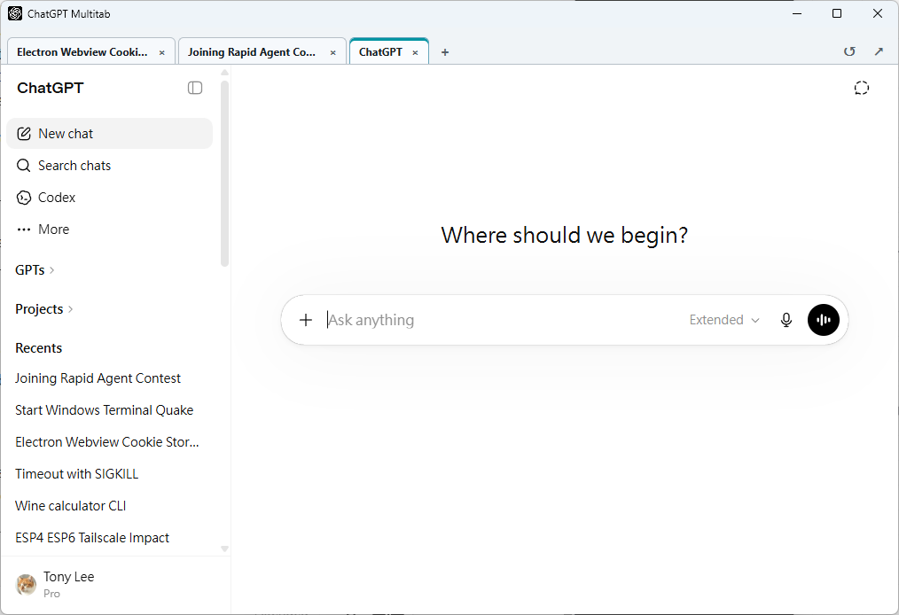

# ChatGPT Multitab System

`ChatGPT Multitab System` is a Chrome extension for local ChatGPT workspace setups where you want to keep ChatGPT open in a multitab iframe layout and selectively allow trusted pages to load inside that workflow.

The extension is built for unpacked local use. It is not packaged for the Chrome Web Store.



## What it does

- Adds a built-in `chatgpt.com` iframe rule for the workspace.
- Mirrors current `chatgpt.com` cookies into matching iframe requests only from whitelisted top-level pages.
- Refreshes those session rules when tabs or ChatGPT cookies change.
- Keeps one hidden ChatGPT tab preloaded so opening a new workspace tab is faster.
- Lets you add exact URLs that should have frame-blocking headers removed.
- Persists your configured URLs in Chrome extension storage.

For configured URLs, the extension removes these response headers when the URL matches exactly and the browser tab's top-level URL is also on the whitelist:

- `X-Frame-Options`
- `Frame-Options`

For built-in `chatgpt.com` iframe navigations, it also removes:

- `Content-Security-Policy`
- `Content-Security-Policy-Report-Only`

## Who this is for

Use this when you are running a trusted local workflow and need to embed ChatGPT or a specific local page that would otherwise refuse to load in a frame.

This is intentionally broad in host access and should only be installed on a machine you control.

## Requirements

- Google Chrome or another Chromium browser that supports Manifest V3 extensions
- Developer mode enabled in `chrome://extensions`

## Install on your machine

1. Download or clone this repository to your machine.
2. Open `chrome://extensions`.
3. Turn on **Developer mode**.
4. Click **Load unpacked**.
5. Select this project directory: `MultitabChatGPT`.
6. Open the extension details page and pin the extension if you want quick access.

If you want to use `file://` URLs, also enable **Allow access to file URLs** in the extension details page.

## Configure it

1. Open the extension popup or the extension options page.
2. Add one or more exact URLs.
3. Save them. The extension refreshes its dynamic rules immediately.

Examples:

```text
http://localhost:8080/
http://127.0.0.1:5173/some/path/
file:///Users/you/example.html
```

Important behavior:

- Matching is exact URL matching, not wildcard matching.
- `https://example.com/page` and `https://example.com/page/` are different URLs.
- Invalid or duplicate entries are normalized before rules are installed.
- Clicking the extension icon opens the config page when the active tab is already whitelisted. Otherwise it opens the primary URL when one is configured.

## How to use it

After loading the extension:

1. Open the extension UI.
2. Add the exact local or trusted page URLs you want to allow in your workflow.
3. Open your ChatGPT multitab workspace.
4. Load the configured page or ChatGPT page inside the framed workflow.

The extension is inactive on non-whitelisted top-level pages: no frame-option header rewrite, no ChatGPT CSP rewrite, and no ChatGPT cookie rewrite.

## Security notes

- The extension requests `<all_urls>` host permissions so it can apply user-entered rules.
- It reads ChatGPT cookies and injects them only into tab-scoped ChatGPT iframe requests from whitelisted top-level pages.
- It is meant for trusted local use, not general browsing.
- Do not add untrusted URLs just to force them into a frame.

## Project layout

- `manifest.json`: Chrome extension manifest
- `options.html`: settings UI
- `src/background.js`: installs and refreshes tab-scoped session rules
- `src/rules.js`: rule generation and URL normalization
- `src/options.js`: options page behavior
- `src/session-state.js`: multitab session state helpers

## Development

Install dependencies:

```sh
npm install
```

Run tests:

```sh
npm test
```

Run syntax checks:

```sh
npm run check
```

## Limitations

- This repo is currently set up for unpacked local installation.
- It does not publish itself to the Chrome Web Store.
- It does not sync settings across browsers.
- CSP removal is limited to the built-in `chatgpt.com` iframe workflow, not arbitrary configured URLs.
