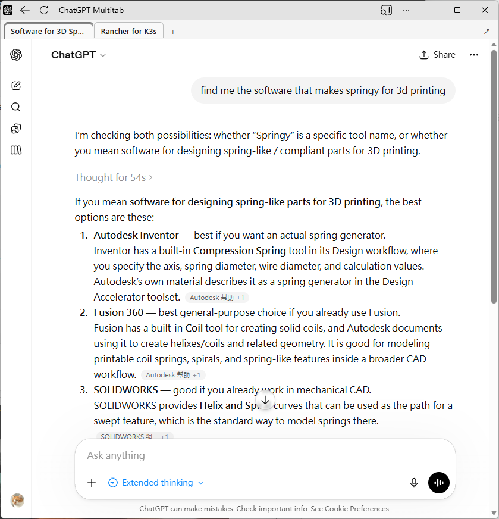

# ChatGPT Multitab System

`ChatGPT Multitab System` is a Chrome extension that lets you use the official ChatGPT UI with workspace tab support.

The extension is built for unpacked local use. It is not packaged for the Chrome Web Store.

| Workspace | Configuration |
| --- | --- |
|  |  |

## What it does

- Lets you use the official ChatGPT web interface in a multitab workspace.
- Keeps multiple ChatGPT tabs available in one browser page.
- Restores all workspace tabs when you reopen the multitab page.
- Uses your existing `chatgpt.com` session so the embedded ChatGPT tabs stay signed in.
- Keeps one ChatGPT tab preloaded so opening a new workspace tab is faster.

Behind the scenes, the extension removes frame-blocking headers only for exact whitelisted URLs and the built-in `chatgpt.com` iframe workflow.

## Requirements

- Google Chrome, Microsoft Edge, or another Chromium browser that supports Manifest V3 extensions
- Developer mode enabled in `chrome://extensions`

## Install on your machine

1. Download or clone this repository to your machine.
2. Open `chrome://extensions`.
3. Turn on **Developer mode**.
4. Click **Load unpacked**.
5. Select this project directory: `MultitabChatGPT`.
6. Open the extension details page and pin the extension if you want quick access.

If you want to use `file://` URLs, also enable **Allow access to file URLs** in the extension details page.

## How to use it

1. Open the extension popup or options page.
2. Add the exact URL for your ChatGPT multitab workspace.
3. Save it.
4. Open the workspace and use ChatGPT in multiple tabs.

Keyboard shortcuts:

- `Ctrl+T` or `Cmd+T`: open a new ChatGPT workspace tab.
- `Ctrl+Tab` or `Cmd+Tab`: switch to the next workspace tab.
- `Ctrl+Shift+Tab` or `Cmd+Shift+Tab`: switch to the previous workspace tab.

Example URLs:

```text
http://localhost:8080/
http://127.0.0.1:5173/some/path/
file:///Users/you/example.html
```

URLs must match exactly. For example, `https://example.com/page` and `https://example.com/page/` are different URLs.

## Security notes

- The extension requests `<all_urls>` host permissions so it can apply user-entered rules.
- It reads ChatGPT cookies and injects them only into tab-scoped ChatGPT iframe requests from whitelisted top-level pages.
- The optional Cloudflare Worker serves the workspace with `frame-ancestors 'none'` and `X-Frame-Options: DENY` so third-party sites cannot iframe the hosted whitelist URL.
- Do not whitelist untrusted URLs.

## Project layout

- `manifest.json`: Chrome extension manifest
- `options.html`: settings UI
- `src/background.js`: installs and refreshes tab-scoped session rules
- `src/rules.js`: rule generation and URL normalization
- `src/options.js`: options page behavior
- `src/session-state.js`: multitab session state helpers

## Development

Install dependencies:

```sh
npm install
```

Run tests:

```sh
npm test
```

Run syntax checks:

```sh
npm run check
```

## Cloudflare Worker

The Cloudflare Worker is optional. You only need it when you want to host the workspace at an HTTPS URL.

Chrome and Edge require an HTTPS path when you use **Install page as app**. Cloudflare Workers are an easy, cheap way to host the workspace with HTTPS.

The Worker lives in `worker/`. Its entrypoint is `worker/src/worker.mjs`, and `worker/wrangler.toml` imports the root `index.html` as text and returns it with a `text/html` response.

The Worker also serves `favicon-inverted.svg`, so the hosted page does not request a missing favicon from the deployment path.

### Deploy

1. Install or run Wrangler.

   ```sh
   cd worker
   npx wrangler --version
   ```

2. Log in to Cloudflare if this machine is not already authenticated.

   ```sh
   npx wrangler login
   ```

3. Preview the Worker locally.

   ```sh
   npx wrangler dev
   ```

4. Deploy to Cloudflare Workers.

   ```sh
   npx wrangler deploy
   ```

After deployment, copy the Worker URL and add that exact URL to the extension whitelist. If you attach a custom route such as `https://example.com/chat/`, add that exact route to the whitelist instead.

You can also deploy from the repository root with an explicit config path:

```sh
npx wrangler deploy --config worker/wrangler.toml
```

## Limitations

- This repo is currently set up for unpacked local installation.
- It does not publish itself to the Chrome Web Store.
- It does not sync settings across browsers.
- CSP removal is limited to the built-in `chatgpt.com` iframe workflow, not arbitrary configured URLs.
